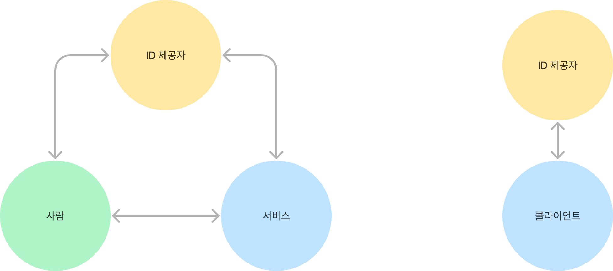

# <small>쓰면서 배우는</small>   OAuth 2.0 <small>&</small>   OpenID Connect

---

## 배울 것

- 인증?  인가?
- 외부 인증 제공자를 통한 인증
- 연관 표준들의 간략한 개요
- 구현 시 주의사항 및 보안 지침
- 알아두면 좋은 토막 지식들

---

## 배우지 않는 것

- 인증 "제공자"가 알아야 하는 것들
- 세션 관리 전략
- 리소스 접근 제어 전략

이 주제들로 심도깊은 얘기를 해보고 싶다면 따로 요청할 것

---

  **Authentication**, AuthN
   vs 
  **Authorization**, AuthZ

잘 구분 하고 있나요? (Tip: 해야됨)

---

**Authentication** → 접근 주체의 **신원(Identity)** 확인

**Authorization** → 접근을 승인 또는 거부

---

예를 들면...

공연장 입장할 때 티켓과 신분증을 보여줌 → 인증

티켓에 할당된 좌석에 착석할 수 있음 → 인가 (승인)

근데 그 티켓 보여줘도 백스테이지는 못들어감 → 인가 (거부)

---

헷갈리는 이유는 아마...

⚠️ Privileged Access ⚠️

(일단 입장만 하면 마음대로 다 할 수 있다)

---

여기서 다루는 내용은 (제공자를 통한) **인증** 구현 입니다.

인가에 대해서는 (거의)  다루지 않아요.

---

### 배경지식. Digital Identity

컴퓨터가 특정 대상(사람, 사물, 장치 등)을 식별할 수 있도록 기록된 특성 집합

1. 대상이 알고 있는 것
2. 대상이 소유한 것
3. 대상인 것

---

인증은 신원을 확인하는 절차로 특성 중 하나 **이상**을 평가함

ex. 니가 Tim 이라고?

1. 대상이 알고 있는 것 → 비밀번호 입력해봐
2. 대상이 소유한 것 → 내가 방금 tim@daangn.com 으로 보낸 코드가 뭐게?
3. 대상인 것 → 여기 지문 찍어봐

---

### 배경지식. Identity Management   & Single Sign-On (SSO)

인증이 필요한 앱 A, B, C... 다 따로 신원을 관리해야 하나?

한 곳(Identity Provider)에서 관리(DBMS, LDAP)하고 인증을 위임하자!

---

### 배경지식. Identity Federation

ID 제공업체 X, Y, Z.... 서비스 제공업체 A, B, C...

Federation은 다양한 파티들이 **표준화된 계약**을 통해 서로가 알고 있는 **Identity를 연결**하는 것\
(OAuth 2, SAML 2, OpenID Connect, Shibboleth ...)

---

### 배경지식. 3-legged vs 2-legged

---

# OAuth 2.0

---

[RFC 6749: The OAuth 2.0 Authorization Framework](https://datatracker.ietf.org/doc/html/rfc6749)

---

OAuth 2는 "사용자 동의"에 따라   "서드파티 서비스"에 리소스에 대한   "제한된 접근"을 위임하기 위한 프로토콜

**"Delegated Authority"**
- 인증을 위한 도구가 아님
- 인가를 위한 도구도 아님

---

### 배경지식. OAuth 2.0 Glossary

- Authorization Server (AS)
- Resource Server (RS)
- Resource Owner (RO)
- Client
  - Credential Client
  - Public Client

---

### 배경지식. OAuth 2.0 Grant Types & Flows

- Authorization Code Grant
- Implicit Grant ❌
- Client Credentials Grant
- Resource Owner Password Credentials Grant ❌
- Device Authorization Grant ([RFC 8628](https://datatracker.ietf.org/doc/html/rfc8628))

---

OAuth 2로 **인증** 구현하기

1. AS는 인가 전 자체적으로 사용자를 인증함
2. 보호된 리소스(ex. `/users/me`)에 접근할 수 있으면 인증되었음이 자명함

---

[예제 구현하기 - GitHub OAuth 2](https://github.com/daangn/oauth-oidc-practice/tree/main/examples/00-oauth-github)

---

OAuth 2는 Application 등록부터 시작

https://github.com/settings/applications/new

- Homepage
- Redirect URI(s)
- Client ID
- Client Secret

---

### 배경지식. Cross-Site Request Forgery (CSRF)

공격자가 인증된 사용자의 세션을 통해 위조된 요청을 전송함

---

### OAuth 2 기반 사용자 인증의 문제점

- OAuth 2 자체는 "사용자"에 대한 디테일을 (의도적으로) 전혀 다루지 않음
- 사용자 인증 방식이 표준화 되지 않아 구현이 통일되지 않음
- 비효율적으로 동작함

---

# OpenID Connect (OIDC)

---

[OpenID 재단](https://openid.net/)에서 주도하는 산업 표준

---

OAuth 2 기반으로 만든 **사용자 인증** 프레임워크

- 인증 제공자 메타데이터 제공 방법
- 사용자 정보 교환 방법
- 사용자 세션 관리 방법
- 기타 등등을 표준화

---

[예제 구현하기 - OIDC](https://github.com/daangn/oauth-oidc-practice/tree/main/examples/01-oidc)

---

# Proof Key Code Exchange (PKCE)

모바일 앱, 웹 기반 SPA와 같은 퍼블릭 클라이언트의 보안 위협을 완화하기 위한 확장 도구

퍼블릭 클라이언트에서는 필수 
퍼블릭 클라이언트가 아니더라도, 가능한 경우 모든 Flow에서 사용하는 것을 권장

---

[예제 구현하기 - OIDC (SPA)](https://github.com/daangn/oauth-oidc-practice/tree/main/examples/02-oidc-spa)

---

### 배경지식. PKCE를 지원 안하면 어떡함?

예시: GitHub App을 만들고 싶은데, 
문서보니까 Credential Client 가이드 밖에 없고 PKCE 지원도 안함.

---

[이렇게](https://github.com/cli/cli/blob/ebcf3a1/internal/authflow/flow.go#L25) 해도 되긴 함...

---

[BFF (Backend for Frontend) pattern is your friend](https://datatracker.ietf.org/doc/html/draft-ietf-oauth-browser-based-apps#name-backend-for-frontend-bff)

- [Cloudflare Pages Middleware](https://developers.cloudflare.com/pages/platform/functions/middleware/)
- [Vercel Edge Middleware](https://vercel.com/docs/functions/edge-middleware)
- [Netlify Edge Functions](https://docs.netlify.com/edge-functions/overview/)

---

### 배경지식. OAuth 2 보안 규범

- [OAuth 2.0 Treat Model and Security Considerations (RFC 6819)](https://datatracker.ietf.org/doc/html/rfc6819)
- [OAuth 2.0 Security Best Current Practice](https://datatracker.ietf.org/doc/html/draft-ietf-oauth-security-topics)
- [OAuth 2.0 for Native Apps (RFC 8252)](https://datatracker.ietf.org/doc/html/rfc8252)
- [OAuth 2.0 for Browser-Based Apps](https://datatracker.ietf.org/doc/html/draft-ietf-oauth-browser-based-apps)
- [Proof Key Code Exchange (RFC 7636)](https://datatracker.ietf.org/doc/html/rfc7636)
- [OAuth 2.1](https://datatracker.ietf.org/doc/html/draft-ietf-oauth-v2-1-08)

---

## 이번 주말에 볼만한 거

- [ForgeRock Identity Series](https://www.youtube.com/playlist?list=PLgNdFtWZuT7a2dCb6pLqHhtzPEC4tdwH9)\
  신원 관리 개념에 대해 쉽게 잘 설명해주는 유튜브 재생 목록
- [아이덴티티 시스템의 7가지 원칙](https://blog.cometkim.kr/posts/the-seven-laws-of-identity/)\
  인증관련 표준들이 모두 공유하는 대원칙을 요약. 전반적인 이해에 도움이 돼요
